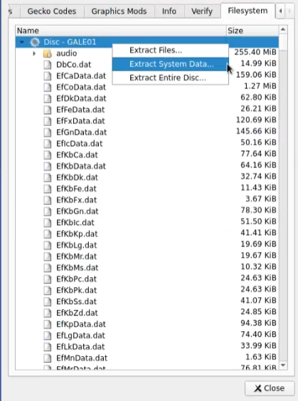
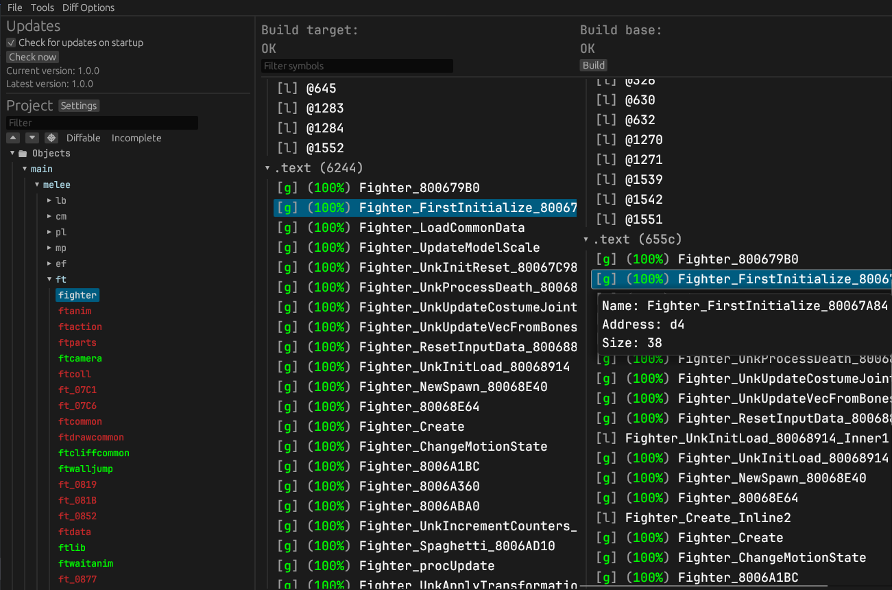
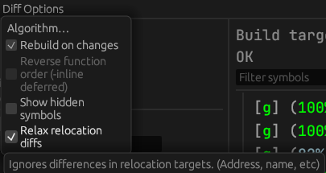

Super Smash Bros Melee \
[![Build Status]][actions]
[![Code Progress]][progress]
[![Data Progress]][progress]
[![Linked Progress]][progress]
[![Discord Badge]][discord]
=============

[Build Status]: https://github.com/doldecomp/melee/actions/workflows/build.yml/badge.svg
[actions]: https://github.com/doldecomp/melee/actions/workflows/build.yml
[Code Progress]: https://decomp.dev/doldecomp/melee.svg?mode=shield&measure=code&label=Code&category=all
[Data Progress]: https://decomp.dev/doldecomp/melee.svg?mode=shield&measure=complete_data&label=Data&category=all
[Linked Progress]: https://decomp.dev/doldecomp/melee.svg?mode=shield&measure=complete_code&label=Linked%20Code&category=all
[Discord Badge]: https://img.shields.io/discord/933849697485983765?color=%237289DA&logo=discord&logoColor=%23FFFFFF
[discord]: https://discord.gg/CWKqYMePX8
[progress]: https://decomp.dev/doldecomp/melee

This repo contains a WIP decompilation of Super Smash Bros Melee (US).

> [!TIP]
> The DOL this repository builds can be shifted! Meaning you are able to now add and remove code as you see fit, for modding or research purposes.

It builds `main.dol`:

|Version|Game ID|SHA-1
-|-|-
1.02|`GALE01`|`08e0bf20134dfcb260699671004527b2d6bb1a45`

# Dependencies

## Windows:
On Windows, it's **highly recommended** to use native tooling. WSL or msys2 are **not** required.
When running under WSL, [objdiff](#diffing) is unable to get filesystem notifications for automatic rebuilds.

- Install [Python](https://www.python.org/downloads/) and add it to `%PATH%`.
  - Also available from the [Windows Store](https://apps.microsoft.com/store/detail/python-311/9NRWMJP3717K).
- Download [ninja](https://github.com/ninja-build/ninja/releases) and add it to `%PATH%`.
  - Quick install via pip: `pip install ninja`

## macOS:
- Install [ninja](https://github.com/ninja-build/ninja/wiki/Pre-built-Ninja-packages):
  ```
  brew install ninja
  ```
- Install [wine-crossover](https://github.com/Gcenx/homebrew-wine):
  ```
  brew install --cask --no-quarantine gcenx/wine/wine-crossover
  ```

After OS upgrades, if macOS complains about `Wine Crossover.app` being unverified, you can unquarantine it using:
```sh
sudo xattr -rd com.apple.quarantine '/Applications/Wine Crossover.app'
```

## Linux:
- Install [ninja](https://github.com/ninja-build/ninja/wiki/Pre-built-Ninja-packages).
- For non-x86(_64) platforms: Install wine from your package manager.
  - For x86(_64), [WiBo](https://github.com/decompals/WiBo), a minimal 32-bit Windows binary wrapper, will be automatically downloaded and used.

# Building
- Clone the repository:
  ```
  git clone https://github.com/doldecomp/melee.git --depth=1
  ```
- Using [Dolphin Emulator](https://dolphin-emu.org/), find your ISO and click `Properties`. Go to the `Filesystem` tab, right-click `Disc - GALE01` and select `Extract System Data`. Choose `orig/GALE01` of this repository.
  - To save space, only `main.dol` (and `.gitkeep`) are necessary. Other files can be deleted.
  
- Configure:
  ```
  python configure.py
  ```
- Build:
  ```
  ninja
  ```

# Tooling

We use Python for our command line tooling. It is recommended that you use a [virtual environment](https://docs.python.org/3/library/venv.html).

1. Create a virtual environment.
    ```sh
    python -m venv --upgrade-deps '.venv'
    ```
1. You'll need to activate it whenever you open a new shell.
    * Windows:
        ```ps1
        .venv/Scripts/Activate.ps1
        ```
    * Linux/macOS:
        ```ps1
        . .venv/bin/activate
        ```
1. After that, you can install or update our packages with:
    ```sh
    pip install -r reqs/decomp.txt
    ```
1. Now you can run `decomp.py` to decomp a function using [m2c](https://github.com/matt-kempster/m2c). Pass it `-h` to see all the options.
    ```sh
    python tools/decomp.py my_function_name
    ```

# Modding
Coming soon.

# Containers
Coming soon.

# Diffing

Once the initial build succeeds, an `objdiff.json` should exist in the project root.

Download the latest release from [encounter/objdiff](https://github.com/encounter/objdiff). Under project settings, set `Project directory`. The configuration should be loaded automatically.

Select an object from the left sidebar to begin diffing. Changes to the project will rebuild automatically: changes to source files, headers, `configure.py`, `splits.txt` or `symbols.txt`.



> [!TIP]
> It's recommended that you enable the `Relax relocation diffs` option under `Diff Options`.



# Contributing

Contributions are welcome! If you're new to decomp, check out our [Getting Started guide](https://doldecomp.github.io/melee/getting_started.html). Before [opening a pull request](https://docs.github.com/en/pull-requests/collaborating-with-pull-requests/proposing-changes-to-your-work-with-pull-requests/creating-a-pull-request), please read our [contributing guidelines](CONTRIBUTING.md). If you're new to Git and don't know how to create a pull request, we encourage you to [create an issue](https://github.com/doldecomp/melee/issues/new) with your decomp.me link and a maintainer will add your code to the repository.

We're also happy to answer any questions in the `#melee` channel on Discord.

[](https://discord.gg/hKx3FJJgrV)

# FAQ
## How is the codebase structured?

The code in `src` is divided into several modules, the main one being `melee`, which is the game code.

### `melee`
The main game code is divided into several two-letter folders, which were left behind by HAL in assert messages and game data on the original disc.

Short|Full|Notes
-|-|-
`cm`|Camera|
`db`|Debug|
`ef`|Effect|Visual effects.
`ft`|Fighter|The player characters.
`gm`|Game|The main game loop.
`gr`|Ground|Stages and other levels.
`if`|Interface|User interface.
`it`|Items|
`lb`|Library|Utility functions that are often thin wrappers around `dolphin` or `baselib` code.
`mn`|Menu|
`mp`|Map|Related to stages and contains things like `mpcoll` (map collisions).
`pl`|Player|As in users.
`sc`|Scene|Menu, versus mode, single-player, etc. The game mode.
`ty`|Toy|Trophies.
`un`|Unknown|This isn't an actual folder in the original code.
`vi`|Visual|Cutscenes, etc.

#### `melee/ft/chara`

HAL also used two-letter abbreviations for each fighter.

Short|Full|Canonical English
-|-|-
`Bo`|Zako<sup>1</sup> Boy|[Male wire frame](https://www.ssbwiki.com/Fighting_Wire_Frames#Male_Wire_Frame.2FCaptain_Falcon)
`Ca`|Captain|Captain Falcon
`Ch`|Crazy Hand|
`Cl`|Child Link|Young Link
`Co`|Common|Shared code
`Dk`|Donkey Kong|
`Dr`|Dr. Mario|
`Fc`|Falco|
`Fe`|Fire Emblem|Roy
`Fx`|Fox|
`Gk`|Giga Koopa|Giga Bowser
`Gl`|Zako Girl|[Female wire frame](https://www.ssbwiki.com/Fighting_Wire_Frames#Female_Wire_Frame.2FZelda)
`Gn`|Ganondorf|
`Gw`|Mr. Game & Watch|
`Kb`|Kirby|
`Kp`|Koopa|Bowser
`Lg`|Luigi|
`Lk`|Link|
`Mh`|Master Hand|
`Mr`|Mario|
`Ms`|Mars|Marth
`Mt`|Mewtwo|
`Nn`|Nana|
`Ns`|Ness|
`Pc`|Pichu|
`Pe`|Peach|
`Pk`|Pikachu|
`Pp`|Popo|
`Pr`|Purin|Jigglypuff
`Sb`|Sandbag|
`Sk`|Seak|Sheik
`Ss`|Samus|
`Ys`|Yoshi|
`Zd`|Zelda|

<sup>1</sup> Zako (雑魚) is Japanese for "trash mob" in video games, literally "small fish."

### `sysdolphin/baselib`

HAL's core internal library.
Class|Full
-|-
`AObj`|Animation
`CObj`|Camera
`DObj`|Draw/Display
`FObj`|Frame
`GObj`|Global/Game
`JObj`|Joint
`LObj`|Light
`MObj`|Material
`PObj`|Polygon
`TObj`|Texture
`RObj`|Reference
`SObj`|Scene
`WObj`|World

### `dolphin`

The [Dolphin SDK](https://wiki.raregamingdump.ca/index.php/Dolphin_SDK).

### `MetroTRK`

The Metrowerks Target Resident Kernel.

### `MSL`

The Metrowerks Standard Library.

### `Runtime`

The Gekko hardware runtime.

## What can be done after decompiling Melee?

Note that this project's purpose is to only match the ASM with C code. This is entirely for research and archival purposes. After this is created, you essentially have a C project that can be compiled into Melee, but it won't be portable (aka you can't compile it to run on a normal computer).

So creating mods would be a lot easier as C code is much easier to consume than ASM. However, there are additional projects that could be undertaken once this is complete, but those technical endeavours are out-of-scope for this repo.

## Do we know how the compiler works?

- Kind of. We don’t have its source though.

### How do we get the compiler to pick a certain register allocation?

Considering we don't have the source for the compiler, this is kind of "anything goes" territory. Unfortunately [register allocation is an NP-hard problem](https://en.wikipedia.org/wiki/Register_allocation?oldformat=true) which means there are all types of heuristics you can use to select registers, some of which can be confused by things as silly as variable names.

One option is to attempt to automatically [permute the source code](https://github.com/simonlindholm/decomp-permuter) to get the correct register allocation.
