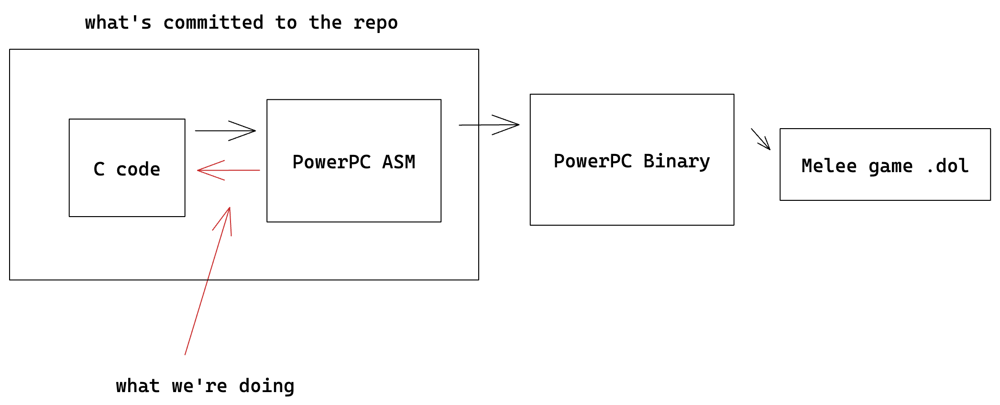

# Introduction

This doc is designed to help beginners get into Melee decompilation (and hopefully contribute). Also, we'll try to answer common questions here and talk about motivations for working on this project.

# Goals of the project

The goal of this repo is to **write C code that, after being compiled, matches the PowerPC assembly 100%**. There's a bit of nuance here though. Let’s first take a look at what we’re working with:



The details for what produces these different artifacts is out-of-scope. Here’s what some Melee C code looks like:

```c
void func_8007B8CC(Fighter* fp, HSD_GObj* otherObj) {
    Fighter* otherFp;

    otherFp = getFighter(otherObj);
    ((u32 *)fp)[0x466] = (u32) otherObj;
    fp->x119C_teamUnk = (u8) otherFp->x61B_team;
    fp->x119D = (u8) otherFp->xC_playerID;
}
```

and it’s corresponding PowerPC assembly:

```asm
.global func_8007B8CC
func_8007B8CC:
/* 8007B8CC 000784AC  80 A4 00 2C */	lwz r5, 0x2c(r4)
/* 8007B8D0 000784B0  90 83 11 98 */	stw r4, 0x1198(r3)
/* 8007B8D4 000784B4  88 05 06 1B */	lbz r0, 0x61b(r5)
/* 8007B8D8 000784B8  98 03 11 9C */	stb r0, 0x119c(r3)
/* 8007B8DC 000784BC  88 05 00 0C */	lbz r0, 0xc(r5)
/* 8007B8E0 000784C0  98 03 11 9D */	stb r0, 0x119d(r3)
/* 8007B8E4 000784C4  4E 80 00 20 */	blr
```

So the repo is filled with `.s` files and `.c` files, where the C code inside the `.c` files should have translated 100% to some contents in a `.s` file that used to be in the repo. Note that once we successfully decompile a function, we normally remove it from the assembly.

# Do we have to write all this C code by hand?

No! And even initially, the code doesn’t have to be super-readable as we’re trying to get 100% match rate first.

So you can actually view the above example in an online tool that we use called decomp.me. Here’s a link to [that specific decompliation](https://decomp.me/scratch/MLlcK). If you want to try doing this yourself, follow these steps:

1. Copy the assembly in the example
2. Hit “New Scratch”
3. Select Platform “GameCube / Wii”
4. Set the preset to “Super Smash Bros. Melee”
5. Copy in the contents of [this link](https://gist.github.com/stephenjayakar/73e9f7a1f77b9b2df281f0629b95290c) into the “Context” section. More on that later
6. Copy in the ASM into “Target assembly” and hit “Create scratch”

When you initially create a new “scratch” in this site, it’ll actually do its best to decompile the assembly you give it (try hitting the “Decompile” button in the link). You’ll notice things it spits out like

```c
temp_r5 = arg1->unk2C;
```

which can be translated in kind-of-English as “tempR5 takes the value at the memory address of `arg1 + 0x2c`.” If you don’t know anything about `arg1`, you can translate it to sketchy-C

```c
// The u8* conversion is because C automatically figures out pointer size for
// you, which means for an s32, you'd have to do arg1 + 0x2c / 4
temp_r5 = *((s32 *) ((u8 *) arg1 + 0x2c))
```

…while this accomplishes the goal of getting a 100% match (you could pretty much do every memory access and set like this), we actually can guess what `arg1` is in this case because of the file it’s in. You can do some digging yourself, but that line ends up translating to something like:

```c
Fighter* otherFp;
otherFp = getFighter(otherObj);
```

## What was going on with the Context?

Think of the context as a giant header file which you then `#include` at the top of your file. You can actually generate this yourself by using `gcc -E`, but a TODO on how to do this.

# Alright, how do I try decompiling?

So you want to find some assembly that:

- no one is working on
- isn’t that long as you’re new
- isn’t already decompiled

In [this public Trello board](https://trello.com/b/pz2ACtnS/melee-decompilation), you can see which Assembly files have been claimed or unclaimed. So don’t pick a function in a `.s` file that’s claimed.

To make sure it’s not already decompiled, take the label (e.g. `func_8007B8CC`) and search the repo for instances of it. If you don’t see any C code definitions with implementations, then it at least hasn’t been committed to the repo.

You then want to make sure no one is working on it. So search [decomp.me](http://decomp.me) for that label, and it’ll flag if anyone has tried decompiling it. If it’s clearly abandoned, it’s probably ok to fork it and try it out.

After you’ve done these steps, follow the above steps for pasting into [decomp.me](http://decomp.me) 🙂.

# Resources

- [PowerPC ISA PDF](https://math-atlas.sourceforge.net/devel/assembly/ppc_isa.pdf). Note that the GameCube’s processor is a PowerPC CPU running in 32bit mode, so some of the instructions’ effects aren’t relevant (e.g. `lwzu` zeros out part of the register, but only in 64bit mode).
    - also note that the floating point registers are 64bit / `double`s.
- [Guide on getting started](https://hackmd.io/@ValorZardK/rkbSHra0Y) that’s a bit more detailed
