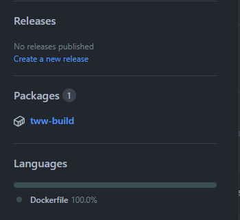
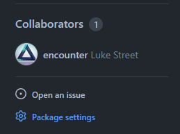
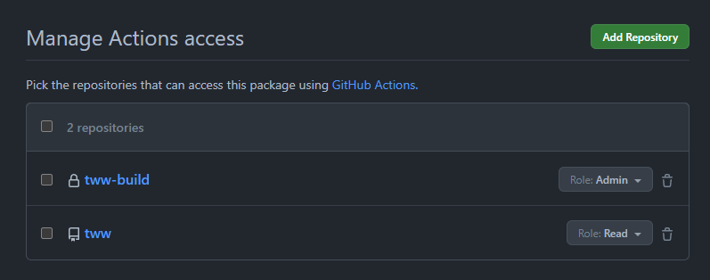
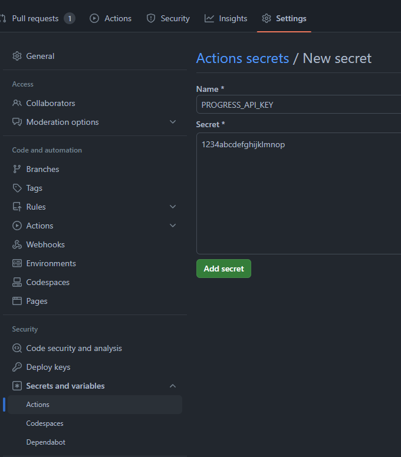

# GitHub Actions

This repository includes [.github.example/workflows/build.yml](/.github.example/workflows/build.yml) as an example CI workflow. To use it for your project, follow the setup instructions below.

- [Build Repository](#build-repository)
- [Progress](#progress)
- [Workflow](#workflow)

## Build Repository

This repository will be used to build and store the CI build container.

> [!CAUTION]
> This repository should be **private** to avoid exposing the game's assets.

1. [Create a **private** repository from `encounter/dtk-template-build`](https://github.com/new?template_name=dtk-template-build&template_owner=encounter). A common name is your project's repository name with `-build` appended. For example, `tww-build`.

2. Once the repository is created, add your game's assets to the `orig/GAMEID` directory. (Replace `GAMEID` with your game's ID, matching the `orig` layout in your main repository.)  
    **Only include game files necessary for the build**, such as `sys/main.dol` and any `.rel` or `.sel` files.

3. Once the build container action completes, visit the package settings:  
      
    

4. Under "Manage Actions access", add your project's main repository with the "Read" role:  
    

## Progress

1. In the [GC/Wii Decompilation Discord](https://discord.gg/hKx3FJJgrV), visit `#frogress` and request an API key for your project.  
    Please provide the following:
    - Project name
    - Repository URL
    - Game ID(s)
    - Whether the game has RELs

2. On GitHub, visit your repo's `/settings/secrets/actions/new` and add a new secret with the name `PROGRESS_API_KEY`:  
    

## Workflow

1. Rename `.github.example` to `.github`.

2. In `build.yml`, update the `container:` to point to the new [build image](#build-repository).

3. In `build.yml`, replace `GAMEID` with your game's ID. (Or list of IDs, for multi-version support.)

4. In `build.yml`, update `PROGRESS_SLUG` to match the project name on [frogress](#progress).

5. Commit and push the changes to your repository.

If everything is set up correctly, the workflow will build all versions on every push or pull request, and upload progress on pushes the `main` branch.
