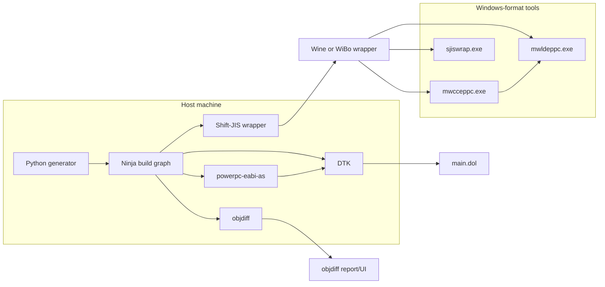

# Decompiling Super Smash Bros. Melee on GameCube: Resources, Tools, and Workflow

## Executive summary

The modern “matching decompilation” approach for GameCube titles reconstructs a buildable source tree that re-produces the original executable byte-for-byte (or with tightly controlled, explainable deltas). The citeturn25search3 repo you’re using (`doldecomp/melee`) is explicitly a work‑in‑progress decompilation that builds `main.dol`, and notes that the produced DOL “can be shifted,” which is useful for research/modding workflows that need code insertion/removal without immediately preserving the original layout. citeturn25search3

In practice, the “hard parts” (and where tooling matters most) cluster into five areas:

A. **Exact toolchain reproduction**: Most matching projects rely on the original (proprietary) Metrowerks/CodeWarrior compiler+linker behavior; the Melee build system automates a lot of surrounding plumbing (binutils, encoding wrappers, linking, DOL packing). citeturn8view0turn9view0turn7view0  
B. **Binary splitting + relinking**: `decomp-toolkit` (DTK) has become the dominant toolkit for GameCube/Wii matching workflows, including DOL analysis/splitting, map/symbol demangling, disc extraction utilities, and `elf2dol`. citeturn1view0turn1view2  
C. **Function-level matching and diffing**: `objdiff` and related utilities provide ergonomic ways to see why a function doesn’t match and what changed at the instruction level. citeturn4search0turn8view0  
D. **Static + dynamic analysis loop**: Ghidra/IDA/radare2 (plus PowerPC/GameCube-specific processor support) and Dolphin’s debugger/GDB stub enable confirming hypotheses at runtime and validating reconstructed symbols. citeturn19search7turn20search0turn20search1turn21search15turn22view0  
E. **Community knowledge & symbol recovery**: Practical progress depends on shared symbol maps, callstack naming, and long-lived community threads/chats. Dolphin can load user-generated symbol maps and (with caveats) generate symbols from signature databases. citeturn18view0  

Legal/IP note (important): Decompilation and reverse engineering can be lawful in some contexts (interoperability, research, preservation, etc.) but distributing copyrighted game code/assets is not. The workflow below assumes you use **your own legitimate disc dump** and keep any extracted proprietary binaries/assets private.

## Core repositories and documentation landscape

### Your two anchor repos

**`doldecomp/melee` (primary project repo)**  
The repo describes itself as a WIP decompilation of Melee (US) that builds `main.dol`, and it advertises a shiftable DOL output. citeturn25search3  
The project’s own “Getting Started” documentation is hosted on `doldecomp.github.io/melee` and is explicitly aimed at onboarding contributors and explaining motivations and common questions. citeturn25search26

Under the hood, the current Melee build generator and tool bootstrap looks very similar to the broader “decomp-template” ecosystem:

- The project configuration pins specific tool tags/versions (binutils, compilers bundle tag, DTK tag, objdiff tag, encoding wrapper tag, wibo tag). citeturn7view0  
- The Ninja generator (`tools/project.py`) defines how MWCC/MWLD, `sjiswrap`, binutils `as`, DTK relinking steps, and `elf2dol` fit together into a reproducible pipeline. citeturn8view0  
- Tool downloads are centralized: DTK/objdiff/sjiswrap/wibo are pulled from GitHub releases, while compilers and some other artifacts are pulled from a dedicated file host (`files.decomp.dev`) keyed by tag (e.g., `compilers_{tag}.zip`). citeturn9view0turn8view0  

**`Savestate2A03/mwcc_debug` (compiler introspection research)**  
This repo describes itself as a *drop‑in replacement* `lmgr326b.dll` used in the Melee decomp project, intended to enable “debug output” from the CodeWarrior PPC compiler (mwcceppc) and writes a `pcdump.txt` with low-level compilation/optimization details (register coloring, optimizer decisions, etc.). citeturn3view0  

Caution: This area overlaps with proprietary toolchain licensing. Treat it as research/instrumentation documentation and ensure any use complies with applicable licenses and laws. (I’m intentionally not providing step-by-step “replace DLL to bypass licensing” instructions.)

### The “DTK + template” ecosystem you’re implicitly inheriting

Many GameCube/Wii matching decomps standardize around:

- **`encounter/dtk-template`**: documents canonical directory layouts (`orig/`, `config/`, `src/`, `asm/`, `build/`), shift‑JIS tips, configuration inputs, and typical build orchestration. citeturn4search3turn4search5  
- **`encounter/decomp-toolkit` (DTK)**: provides commands for DOL info/config/splitting/diffing, ELF utilities (including `elf2dol`), map tools, and disc utilities that can verify dumps against Redump and extract/compact filesystem data. citeturn1view0turn1view2  

This matters because Melee’s build scripts directly invoke DTK subcommands like `elf2dol` and “ELF fixup” steps, and it uses DTK’s “map/symbol” tooling as part of the matching workflow. citeturn8view0turn1view0  

## Comparative tool matrix

The table below compares the most relevant tooling for a Melee decomp environment. For tools whose upstream licensing/OS support is not clearly stated in the retrieved primary docs, the entry flags that explicitly instead of guessing.

| Tool | Primary purpose in a Melee decomp | OS support (practical) | License | Primary source | Pros / cons for Melee |
|---|---|---|---|---|---|
| decomp-toolkit (DTK) | DOL/ELF utilities (`dol info`, `dol split`, `dol diff`, `elf2dol`, map tools, disc extract/verify) | Cross-platform in practice (Rust toolchain; used broadly) | Not stated in retrieved snippet (check repo) | citeturn0search3turn1view0turn1view2 | **Pros:** “one toolkit” for splitting, diffing, relinking. **Cons:** you still need correct compiler outputs for matching. |
| dtk-template | Reference build layout + conventions | Cross-platform docs | CC0-1.0 | citeturn4search3turn4search5 | **Pros:** reduces “unknown unknowns.” **Cons:** generic; Melee repo differs in details. |
| objdiff | Function/object diff UI/CLI integration | Cross-platform in practice | Not stated in retrieved snippet (check repo) | citeturn4search0turn8view0 | **Pros:** tight feedback loop on mismatches. **Cons:** requires good symbol mapping. |
| mwcceppc + mwldeppc (CodeWarrior MWCC/MWLD) | Target-accurate compiler + linker behavior (critical for byte matching) | Windows native; elsewhere via wrapper | Proprietary | citeturn8view0turn9view0 | **Pros:** closest to original build. **Cons:** licensing/availability constraints; non-native execution friction. |
| sjiswrap | Ensures Shift‑JIS input expectations for Windows MWCC tools | Windows native; non-Windows via wrapper (Wine/WiBo) | MIT | citeturn9search11turn8view0 | **Pros:** solves encoding pitfalls that cause silent mismatches. **Cons:** another “Windows exe” dependency. |
| WiBo | Lightweight Windows binary runner used in decomp pipelines | Linux x86/x86_64; macOS experimental | GPL-2.0 | citeturn9search10turn8view0 | **Pros:** avoids full Wine in some cases, simplifies CI. **Cons:** platform/compat edge cases; macOS marked experimental. |
| encounter/gc-wii-binutils | PowerPC assembler/linker utilities used for `.s` assembly steps | Cross-platform releases in practice | Not stated in retrieved snippet (check repo) | citeturn9view0turn8view0 | **Pros:** predictable assembler behavior. **Cons:** still needs DTK “elf fixup” in Melee pipeline. |
| devkitPPC (devkitPro GCC toolchain) | Alternate compiler/debugger suite used for homebrew or non-matching builds; provides `powerpc-eabi-*` tools | Windows/macOS/Linux distribution via devkitPro | Toolchain components vary; generally open-source | citeturn19search9turn19search13 | **Pros:** great for experiments, custom tooling, some debugging. **Cons:** GCC output won’t match MWCC byte-for-byte. |
| GNU binutils (`objdump`, `readelf`, `nm`, `objcopy`) | Inspect ELF headers/sections/symbols; disassembly of ELF | Cross-platform (system packages) | GPL (binutils) | citeturn19search6turn19search2turn19search18 | **Pros:** standard, scriptable. **Cons:** needs ELF inputs (not raw DOL). |
| dol2elf (randomstuff) | Wrap a DOL in an ELF container for tooling that expects ELF | Cross-platform source | Not stated in retrieved snippet (check repo) | citeturn16search2 | **Pros:** makes objdump/readelf workflows easier. **Cons:** “containerization” doesn’t magically recover symbols/relocs. |
| elf2dol (DTK or devkitPro) | Packs a linked ELF back into a DOL | Cross-platform (depends on implementation) | Varies by implementation | citeturn1view0turn16search1turn8view0 | **Pros:** required finalization step for Dolphin testing. **Cons:** DOL layout must match expected memory map. |
| ppcdis | PowerPC disassembly + analysis pipeline (DOL/REL oriented) | Cross-platform (Python) | Not stated in retrieved snippet (check repo) | citeturn16search0 | **Pros:** DOL-first disassembly model. **Cons:** learning curve; needs correct loaders/config. |
| Ghidra | SRE platform: disassembly + decompiler + scripting | Windows/macOS/Linux | Apache-2.0 | citeturn19search7turn19search3 | **Pros:** powerful analysis + automation. **Cons:** vanilla PowerPC support can mis-handle GameCube ABI quirks (e.g., SDA regs). citeturn20search18 |
| ghidra-gekko-broadway-lang | Ghidra processor/language enhancements for Gekko/Broadway (paired singles, etc.) | Same as Ghidra | (Check repo; not in snippet) | citeturn20search2 | **Pros:** specifically targets GameCube/Wii CPU variants. **Cons:** install/maintenance overhead across Ghidra versions. |
| IDA Pro | Commercial disassembler + optional decompiler/debugger | Windows/macOS/Linux | Proprietary | citeturn20search0turn20search12 | **Pros:** mature workflows, strong interactive reversing. **Cons:** cost; GameCube-specific loaders/plugins vary. |
| radare2 + Iaito | CLI RE framework + official GUI | Linux/macOS/Windows | LGPLv3 | citeturn20search1turn20search13 | **Pros:** scriptable, “Swiss army knife.” **Cons:** project ergonomics vary; PPC workflows need elbow grease. |
| Rizin | radare2-derived RE framework emphasizing usability | Cross-platform | LGPL-3.0 / GPL-3.0 components | citeturn20search17 | **Pros:** cleaner UX path than radare2 for some teams. **Cons:** smaller community than Ghidra/IDA. |
| m2c | Decompiler focused on matching decomp workflows | Cross-platform in practice | Not stated in retrieved snippet (check repo) | citeturn4search1 | **Pros:** accelerates first-pass C output from PPC. **Cons:** output needs heavy human cleanup and match work. |
| decomp.me | Web-assisted decomp scratchpad/iteration | Web app (local or hosted) | (Not in snippet) | citeturn4search2 | **Pros:** tight compile/diff loop per function. **Cons:** depends on good context headers and build scripts. |
| decomp-permuter | Systematically permutes code to match compiler register allocation/ordering | Cross-platform (Python) | Not stated in retrieved snippet (check repo) | citeturn14search1turn25search26 | **Pros:** extremely useful for “almost matches.” **Cons:** compute-heavy; can hide understanding if overused. |
| asm-differ | Assembly differ for decomp matching | Cross-platform (Python) | Not stated in retrieved snippet (check repo) | citeturn14search2 | **Pros:** clear instruction-by-instruction diffs. **Cons:** needs stable baseline disasm. |
| Dolphin debugger | Interactive runtime debugging (breakpoints, stepping, memory) | Windows/macOS/Linux | GPL-2.0+ (project) | citeturn21search15turn18view0 | **Pros:** validates behavior; integrates with symbol maps. **Cons:** feature discoverability; forum docs may be hard to access via automation. |
| Dolphin GDB stub | Remote debugging via GDB protocol (network socket) | Same as Dolphin | GPL-2.0-or-later | citeturn22view0turn23view0turn21search0 | **Pros:** scriptable debugging, integrates with `target remote`. **Cons:** setup friction; port/config details matter. |
| Wiimms ISO Tools (wit/wwt/…) | Extract/modify/compose Wii+GameCube disc images | Linux + Windows (Cygwin) + macOS binaries available | GPLv2+ | citeturn24search3turn24search17turn27search8turn27search14 | **Pros:** robust ISO manipulation, CLI automation. **Cons:** not “Melee-specific.” |
| gc_fst | Cross-platform ISO filesystem extract/rebuild | Linux/Windows/(probably macOS) | Apache-2.0 and MIT | citeturn27search0 | **Pros:** modern cross-platform alternative to older GUI tools. **Cons:** smaller community than wit. |
| GCRebuilder | GUI-oriented GameCube image editor (extract/replace/rebuild) | Windows-focused | Repo license not clear; distribution listings may be CC BY-NC-ND | citeturn25search4turn27search5 | **Pros:** historically popular for GC modding. **Cons:** original author notes code quality and Windows-only GUI limitations. citeturn25search4 |
| BrawlBox / BrawlCrate | Asset editing tooling primarily for Brawl-era formats | Windows-centric (.NET); Wine possible | Varies (often LGPL/GPL in forks) | citeturn24search8turn24search2turn24search16 | **Pros:** strong for Brawl/PAC/PCS workflows. **Cons:** not first-choice for Melee DAT/HSD formats. |
| DAT Texture Wizard | Melee-focused disc tree & DAT/texture workflow tooling | Windows-centric | Distribution listing: CC BY‑NC‑ND 4.0; repo bundles tools with various licenses | citeturn27search15turn27search13turn25search8 | **Pros:** established Melee texture pipeline. **Cons:** modding-focused; less central to code decomp. |

## Recommended end-to-end decomp workflow

This section is written as a **practical, reproducible loop** that aligns with how `doldecomp/melee` and the DTK ecosystem are structured today. citeturn25search3turn8view0turn1view0  

### Environment and tool bootstrap

1. Install baseline build prerequisites: **Python 3**, **Ninja**, and a working C/C++ build environment for native helper tools. The Melee project is built around a Python generator that emits Ninja rules and orchestrates tool downloads. citeturn8view0turn7view0  

2. Plan for the MWCC Windows toolchain execution path on your OS:
   - On non-Windows systems, the Melee build scripts explicitly support running `.exe` tools via a wrapper (WiBo or Wine), and they download WiBo automatically when the platform matches the project’s heuristics. citeturn8view0turn9search10turn7view0  
   - Encoding into Shift‑JIS is treated as part of the build graph via `sjiswrap`, which is invoked directly on Windows or via the same wrapper on other OSes. citeturn8view0turn9search11  

3. Let the project fetch/pin its toolchain:
   - Melee’s pinned tags include versions for binutils, DTK, objdiff, sjiswrap, WiBo, and the “compilers bundle.” citeturn7view0turn8view0  
   - The download logic shows compilers are fetched as `compilers_{tag}.zip` from `files.decomp.dev` by tag. citeturn9view0turn8view0  
   **Practical recommendation:** treat tool tags like part of your “lockfile.” If you update them, do it deliberately and document why.

### Obtain and validate your baseline binary legally

4. Start from a **verified dump** of your own disc. DTK includes disc tooling to list/info/verify dumps (and can verify against the Redump database according to its docs). citeturn1view2  

5. Extract `main.dol` and any needed filesystem assets into the structure expected by the repo (commonly `orig/<GAMEID>/…`). DTK’s disc extraction utilities are designed for this style of workflow. citeturn1view2turn4search3  

### Build, compare, and iterate (the core matching loop)

6. Generate the build files and configuration from the repo’s configure/generator system (Python → Ninja). The generator emits rules that:
   - compile C/C++ with MWCC,  
   - assemble `.s` with `powerpc-eabi-as`, then apply a DTK “ELF fixup” step,  
   - link with MWLD, then produce `main.dol` via DTK `elf2dol`,  
   - and write `objdiff.json` to support structured diffing. citeturn8view0  

7. Confirm output correctness at two levels:
   - **Macro:** hash/whole‑file verification against the extracted original DOL (DTK `dol diff` or repo-integrated checks). DTK explicitly provides DOL diff utilities. citeturn1view0  
   - **Micro:** function-by-function diffs using objdiff, driven by `objdiff.json` produced by the build generator. citeturn8view0turn4search0  

8. When a function does not match, pick the “fastest feedback” path:
   - Use `asm-differ` style diffs for instruction-level insight. citeturn14search2  
   - Use `decomp.me` as a scratchpad for per-function iteration when you need quick compile/diff loops with a controlled context. citeturn4search2  
   - If the mismatch is “compiler choice” rather than “logic,” consider `decomp-permuter` to explore source permutations that trigger MWCC to emit the expected code shape (a tactic commonly discussed in matching decomp workflows). citeturn14search1turn25search26  

### Static + dynamic analysis integration

9. Static analysis pass:
   - For Ghidra users, consider installing a GameCube/Wii-aware language definition such as `ghidra-gekko-broadway-lang`, which explicitly supports paired singles and other CPU-variant details. citeturn20search2  
   - Be aware of ABI quirks: community reports note that GameCube/Wii code often uses *two* SDA/TOC-related registers (`r2` and `r13`), and default Ghidra decompilation can mis-handle `r13` without configuration tweaks. citeturn20search18  

10. Dynamic analysis pass in Dolphin:
   - Dolphin can load a community symbol map (`.map`) when placed in its user folder `Maps` directory, and symbols can be loaded via a `Symbols -> Load Symbol Map` path; the “Code view” then shows symbols and callstacks. citeturn18view0  
   - Dolphin can also generate a first-pass symbol map from a signature database and save it, but the documentation warns this can introduce false positives that require cleanup. citeturn18view0  
   - For interactive debugging usage (breakpoints, stepping, memory), the TASVideos Dolphin debugger tutorial remains one of the most detailed public references. citeturn21search15  

image_group{"layout":"carousel","aspect_ratio":"16:9","query":["Dolphin emulator debugger code view screenshot","Ghidra PowerPC decompiler window screenshot","objdiff decompilation diff tool screenshot","GameCube ISO tools wit command line screenshot"],"num_per_query":1}

### Optional: remote debugging via Dolphin’s GDB stub

11. If you want scriptable debugging (especially for regressions, instrumentation, or automated breakpoint workflows), Dolphin contains a GDB stub implementation that listens on a configured port, accepts a client connection, and supports memory/register access and breakpoints in a GDB-remote style protocol. citeturn22view0turn23view0  

You can see the configuration knobs in Dolphin’s config definitions (`GDBSocket`, `GDBPort`, default `-1`). citeturn23view0 A commonly referenced practical setup is to set `GDBPort` (e.g., 9090) in `Dolphin.ini`, then connect with `gdb` using `target remote`. citeturn21search0turn21search20  

For a PowerPC-targeting GDB workflow, devkitPPC is widely described as shipping PowerPC EABI GCC including GDB, and WiiBrew’s debugging page describes remote debugging with GDB and the role of debug stubs/targets. citeturn19search9turn21search10  

## Common tasks and command examples

The commands below are deliberately “building blocks” rather than a single monolithic script. They reflect tool capabilities documented in DTK/binutils/WIT/Dolphin sources and the way Melee’s build scripts wire tools together. citeturn1view0turn8view0turn19search6turn24search6turn23view0  

### Convert between DOL and ELF for analysis and tooling

```bash
# Wrap a DOL in an ELF container (useful for readelf/objdump workflows)
dol2elf main.dol main.elf
```

citeturn16search2

```bash
# Pack a linked ELF into a DOL (DTK provides elf2dol; Melee’s build uses DTK elf2dol)
dtk elf2dol main.elf main.dol
```

citeturn1view0turn8view0

### Inspect ELF structure and symbols

```bash
# ELF header + sections (readelf provides detailed ELF inspection)
powerpc-eabi-readelf -h -S main.elf

# Disassemble with symbol demangling where possible
powerpc-eabi-objdump -d -C main.elf | less
```

citeturn19search2turn19search18turn19search6

### DTK-driven DOL analysis, splitting, diffing

```bash
# Basic info about a DOL
dtk dol info orig/GALE01/sys/main.dol

# Produce a starter config template (DTK supports dol config)
dtk dol config orig/GALE01/sys/main.dol

# Split using a config (DTK supports dol split)
dtk dol split config.yml

# Compare two DOLs (DTK supports dol diff)
dtk dol diff orig/GALE01/sys/main.dol build/main.dol
```

citeturn1view0turn1view2

### ISO extraction and rebuild/compose workflows

Using Wiimms ISO Tools (`wit`) as a CLI-centric approach:

```bash
# Extract a GameCube ISO filesystem
wit extract game.iso extracted_dir/

# Compose/rebuild an image from an extracted tree (consult wit docs for exact options)
wit compose extracted_dir/ rebuilt.iso
```

citeturn24search6turn24search3turn24search29

(A cross-platform alternative for filesystem extraction/rebuild is `gc_fst`, which explicitly positions itself as comparable to GCRebuilder/gcmod and claims Linux/Windows/(probably macOS) support.) citeturn27search0  

### Load symbol maps in Dolphin

The most reproducible, tool-agnostic approach is to produce a community symbol map and load it in Dolphin:

1. Save `<GAMEID>.map` into Dolphin’s user folder `Maps` directory. citeturn18view0  
2. Confirm by loading manually with `Symbols -> Load Symbol Map`. citeturn18view0  
3. Enable the “Code” view to see callstacks and symbolized code. citeturn18view0  

### Remote-debug Melee in Dolphin with GDB (advanced)

A typical GDB-remote shape looks like:

```gdb
# Start gdb with an ELF that has symbols/types helpful for your session
(gdb) file build/main.elf

# Connect to Dolphin's gdb stub (port must match Dolphin's GDBPort)
(gdb) target remote 127.0.0.1:9090

# Example: break at an address or symbol (if symbols loaded in gdb)
(gdb) break *0x80012345
(gdb) continue
```

This aligns with (a) the general GDB remote stub model described in the GDB manual and (b) Dolphin’s implementation of a socket-based GDB stub with memory/register access and breakpoint handling. citeturn21search20turn22view0turn23view0turn21search0  

## Communities, forks, and living knowledge bases

### Official project docs and decomp “infrastructure”

- The project’s onboarding documentation (“Getting Started”) is maintained on `doldecomp.github.io/melee`, designed specifically for beginners and contributors. citeturn25search26  
- The broader decomp infrastructure includes `decomp.me` (scratchpad/iteration) and the `decomp.dev` ecosystem referenced by Melee’s build scripts (notably the tool/compilers download host). citeturn4search2turn9view0turn8view0  
- `itsgrimetime/melee-decomp` is a newer adjacent tooling repo aimed at coordinating iteration on unmatched functions (including local decomp.me instances and synchronizing scratches). citeturn25search20  

### Discussion hubs

Because Discord invite availability changes over time, it’s useful to rely on **directories** rather than single-purpose invite links:

- `melee.tv` provides a Discord server directory, and explicitly points users toward lists of Melee communities. citeturn25search12  
- Smashcords has a Melee server directory intended to browse verified community servers. citeturn25search23  

Within the decomp ecosystem, many projects also use GitHub Issues/PR threads as the most “archivable” discussion. For Melee specifically, `doldecomp/melee` surfaces a Discord badge alongside code/data progress, implying active coordination via chat plus repository-based tracking. citeturn25search3  

### Modding-focused tools that still help decomp work

Even if your end goal is code decomp (not textures), modding tools are sometimes valuable for **asset inspection, file format understanding, and fast experiments**:

- DAT Texture Wizard is framed as a Melee texture hacking tool that can view/extract/import textures from the disc tree. citeturn25search8turn27search15  
  The actively maintained fork on GitHub documents third-party components and licensing notes for bundled utilities (e.g., `wimgt`, `pngquant`, `xxHash`). citeturn27search13  
- Wiimms ISO Tools (`wit`) explicitly supports extracting, patching, and composing GameCube images with extensive CLI documentation and multi-OS binaries. citeturn24search6turn24search17turn27search14  
- GCRebuilder remains a known GameCube image editor, but its own repo notes Windows-only GUI constraints and limited maintenance/refactoring appetite from the author. citeturn25search4turn27search5  

(Direct Smashboards threads could not be linked here due to automated browsing restrictions; where relevant, use neutral “directory” sources and public GitHub/GameBanana mirrors that reference the same tools and workflows. citeturn27search19turn25search19)

## Workflow diagrams

### High-level decomp workflow

```mermaid
flowchart TD
  A[Verified disc dump (your own)] --> B[Extract main.dol + filesystem]
  B --> C[DTK: dol info/config/split]
  C --> D[Project generator: configure.py -> Ninja]
  D --> E[Compile C/C++ with MWCC (via Wine/WiBo if needed)]
  D --> F[Assemble .s with powerpc-eabi-as]
  F --> G[DTK: elf fixup]
  E --> H[Link with MWLD using .lcf]
  G --> H
  H --> I[DTK: elf2dol -> main.dol]
  I --> J[DTK/objdiff: match verification]
  J -->|mismatch| K[Iterate: asm-differ / decomp.me / permuter]
  J -->|match| L[Runtime validation in Dolphin (symbols + debugger)]
```

citeturn8view0turn1view0turn1view2turn14search2turn4search2turn14search1turn18view0  

### Toolchain wiring for Melee-style builds



citeturn8view0turn9view0turn9search10turn9search11turn1view0turn4search0